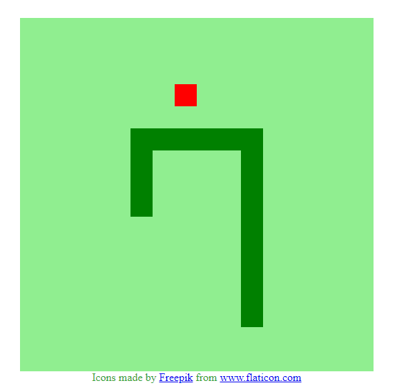
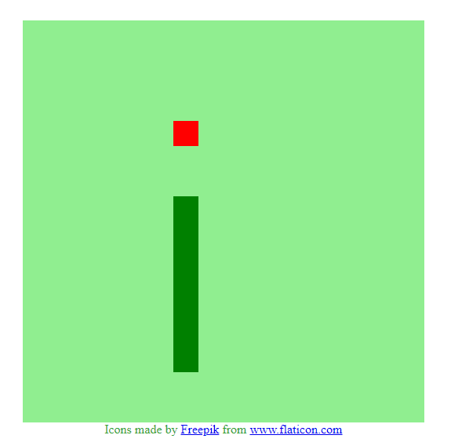

# Snake

## Sobre o projeto.
Lançado para os fliperamas, o jogo era monocromático e o personagem era movido pelas setas do teclado, porém sua única diferença era sua jogabilidade multiplayer. Seu objetivo também era o mesmo, cada personagem tinha que “comer” o que aparecia na tela e evitar choques contra os muros do cenário.

Data de conclusão: 17/11/2021

## Ferramentas e tecnologias usadas nesse projeto.
 
```js    
function Snake(Project) {
    const FrontEnd = `${HTML}, ${CSS}, ${JavaScript}`;
};

``` 
<br>

<div align="center">




</div>

---

> - Autores: 
>   - [Eduardo Kayke](https://github.com/EduardoKayke "Perfil do Eduardo")

- [Voltar ao perfil do Github.](https://github.com/EduardoKayke "Perfil do Eduardo")

_Um dia seremos a tecnologia. Biohacking a própria evolução de nós mesmos._
